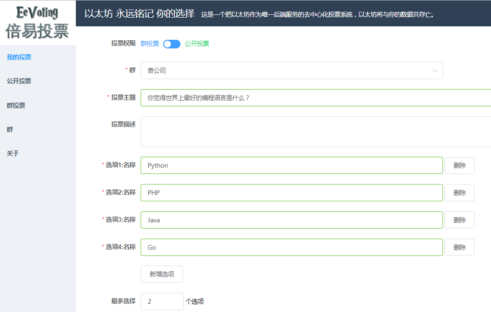
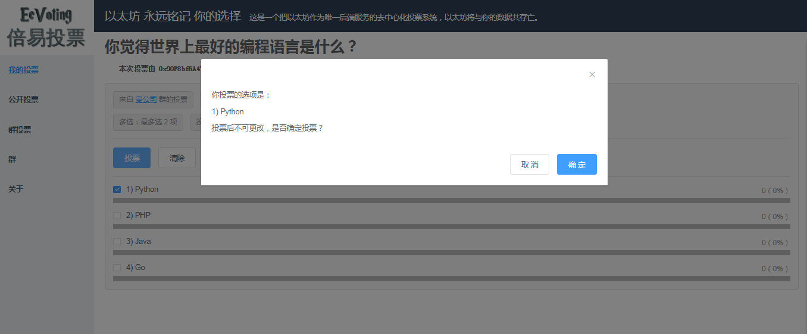

# EEVoting (倍易投票)

> 倍易投票是一个把以太坊作为唯一后端服务的去中心化投票系统。

> EEVoting is a decentralized voting system using ethereum blockchain as the only backend service

## 页面截图

发布投票



参与投票



## development setup

``` bash
# install dependencies
npm install -g truffle@5.0.0-beta.0
npm install -g ganache-cli@6.1.8
npm install

# start ganache-cli
./ganache/start

# compile contracts
truffle compile

# deploy contracts
truffle deploy --reset

# serve with hot reload at 0.0.0.0:8540
npm run dev

# open browser and visit http://yourhost:8540
```

## setup with docker

```
cd docker
docker-compose up -d
docker-compose logs -f --tail 10

# wait until server listening on 8540 port
# open browser and visit http://yourhost:8540
```
